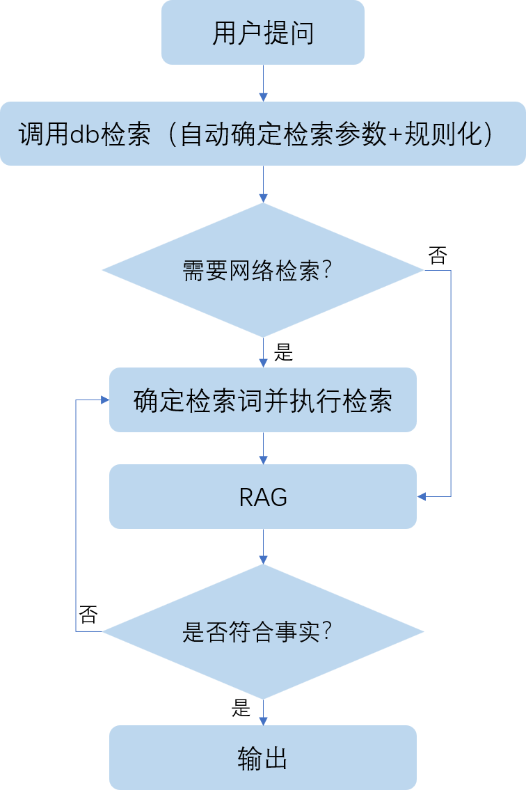
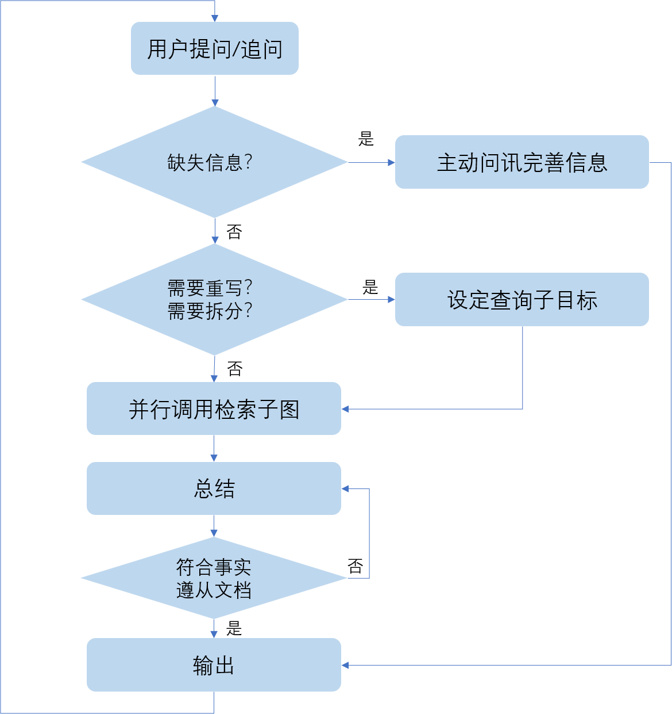

# Medical RAG - 医疗智能问答系统

基于 LangChain 0.3.27 + Milvus 2.6.x + LangSmith + langgraph 0.6.6 的专业医疗领域RAG(检索增强生成)系统，支持多向量混合检索和智能问答。
使用约定数据格式，可无缝迁移到其他领域，例如：法学、金融


## 🌟 项目亮点

- **专业医疗领域优化**：支持领域稀疏向量计算，可直接通过配置完成领域词表管理；也可以使用原生的Milvus进行稀疏向量管理
- **多向量混合检索**：稠密向量 + 稀疏向量(BM25) 的混合检索策略
- **灵活的架构设计**：支持一键配置多种LLM提供商（OpenAI、Ollama）和嵌入模型
- **完整的数据流水线**：从数据预处理、入库到检索问答、以及评估的端到端解决方案
- **RAG智能体**：自动确定检索内容、检索参数、自动确定是否符合文档事实、自动确定是否开启网络检索，将检索功能全部交由智能体托管，一站式定义查询即可得到你想要的答案！
- **更丰富的工程细节**：自带token估计、摘要提取、检索文档动态整合等重要特性，在多轮对话性能强悍。

## 🏗️ 项目主要架构

```
medical-rag/
├── src/MedicalRag/
│   ├── config/              # 配置管理系统
│   │   ├── models.py        # Pydantic配置模型
│   │   ├── loader.py        # 配置加载器
│   │   └── app_config.yaml  # 默认配置文件
│   ├── core/                # 核心组件
│   │   ├── utils.py         # LLM/嵌入模型创建工具
│   │   ├── KnowledgeBase.py # 多向量知识库
│   │   ├── HybridRetriever.py # 混合检索器
│   │   ├── insert.py        # Milvus入库工具类
│   │   ├── DBFactory.py     # 知识库工厂，并行检索时保证单例客户端的线程安全
│   │   └── IngestionPipeline.py # 数据入库流水线
│   ├── embed/               # 嵌入相关
│   │   ├── vocab/           # 领域词表默认保存目录
│   │   ├── sparse.py        # BM25稀疏向量实现
│   │   └── bm25.py          # BM25适配器
│   ├── data/                # 数据处理
│   │   └── annotation.py    # 自动标注系统
│   ├── rag/                 # RAG核心
│   │   ├── RagBase.py       # RAG实现的基类
│   │   ├── RagEvaluate.py   # RAG评测的基类与实现类
│   │   ├── utils.py         # 工具类
│   │   ├── MultiDialogueRag.py   # 多轮对话实现类
│   │   └── SimpleRag.py     # 基础RAG实现
│   ├── prompts/             # 提示词管理
│   │   └── templates.py     # 提示词模板
│   └── agent/               # 智能体实现
│   │   ├── tools/           # 工具包
│   │   │     ├── AgentTools.py   # 工具类
│   │   │     └── TencentSearch.py   # 腾讯云网络检索器
│   │   ├── utils.py  # 工具函数
│   │   ├── AgentBase.py     # 智能体基类
│   │   ├── MedicalAgent.py  # 多轮问讯智能体
│   └── └── SearchGraph.py   # 单轮对话智能体
├── scripts/                 # 使用脚本
├── Milvus/                  # Milvus客户端启动相关
└── .vscode/                 # vscode快捷运行配置
```

## 🚀 快速开始

### 1. 环境准备

#### 数据集
[huatuo-qa](https://www.huatuogpt.cn/) 数据集
也可以使用本项目提供的由 `huatuo-qa` 采样而来的数据集用作示例，详见 `data` 目录

#### 使用conda环境
```bash
git clone https://github.com/yolo-hyl/medical-rag
cd medical-rag
conda env create -f environment.yml
```

#### 安装本项目
```bash
cd src
pip install -e .
```

#### 启动基础服务

**启动 Milvus 向量数据库**

由于本项目默认可以采用稀疏向量管理，所以需要使用客户端Milvus。

```bash
# 使用项目提供的脚本
cd Milvus
bash standalone_embed.sh start
```

**启动 Ollama（如果使用本地模型）**
```bash
# 安装并启动 Ollama
ollama serve

# 拉取所需模型
ollama pull bge-m3:latest      # 嵌入模型
ollama pull qwen3:32b          # 对话模型
```
更多配置详见 [Ollama](https://ollama.com/)

### 2. 配置及向量库说明

编辑 `src/MedicalRag/config/app_config.yaml`可修改默认配置，也可在引入config时动态修改部分配置：

```yaml
# Milvus向量数据库配置
milvus:
  uri: http://localhost:19530
  token: null
  collection_name: medical_knowledge
  drop_old: true  # 第一次建库时，是否删除同名 collection，调试用，生产环境严禁使用
  auto_id: false  # 可选是否自动生成id，否则采用hash值作为id自动去重

# 嵌入模型配置（支持多向量字段）
embedding:
  summary_dense:      # 问题向量（稠密）
    provider: ollama
    model: bge-m3:latest
    base_url: http://localhost:11434
    dimension: 1024
  text_dense:         # 文本向量（稠密）
    provider: ollama  
    model: bge-m3:latest
    base_url: http://localhost:11434
    dimension: 1024
  text_sparse:        # BM25稀疏向量
    provider: self    # 或 "Milvus" 使用内置BM25
    vocab_path_or_name: vocab.pkl.gz
    algorithm: BM25
    domain_model: medicine  # 医疗领域分词
    k1: 1.5
    b: 0.75

# 大语言模型配置  
llm:
  provider: ollama
  model: qwen3:32b
  base_url: http://localhost:11434
  temperature: 0.1

# 数据字段映射
data:
  summary_field: question    # 问题字段
  document_field: answer     # 答案字段
  default_source: qa
  default_source_name: huatuo_qa

# 多轮对话配置
multi_dialogue_rag: 
  estimate_token_fun: avg  # 默认token估计方式
  llm_max_token: 1024  # 大模型最长token数量
  cut_dialogue_scale: 2   # 预估达到最长token时的裁切比例，2表时裁切一半的历史对话生成摘要
  max_token_threshold: 1.01   # 最长token的缓冲值 > 1 表示宽松策略，<1 表示严格策略
  smith_debug: false  # 是否使用 Langsmith 进行debug查看
  console_debug: true  # 是否启用控制台日志查看
  thinking_in_context: false  # 是否将思考内容加入上下文历史对话

agent:  # 智能体会沿用上述多轮对话rag的配置
  mode: analysis
  max_attempts: 2  # 每一个子目标查询的最大重试次数，否则进行联网搜索
  network_search_enabled: True  # 是否启用联网搜索
  network_search_cnt: 10  # 开启联网搜索时，返回的数量
  auto_search_param: True  # 是否开启确定搜索参数
```

### 3. 快速使用

#### 1. 构建BM25词表（自管理模式）

当配置 `embedding.text_sparse.provider: "self"` 时需要先构建词表：

```bash
conda activate rag
python scripts/01_build_vocab.py
```

领域分词依赖 [pkuseg](https://github.com/lancopku/pkuseg-python) 库，更多领域可详见其项目主页。

#### 2. 数据入库

数据配置

```yaml
data:
  summary_field: question
  document_field: answer
  default_source: qa
  default_source_name: huatuo_qa
  default_lt_doc_id: ''
  default_chunk_id: -1
```

支持医疗QA数据的批量入库，自动处理多向量字段：

```bash
conda activate rag
python scripts/02_ingest_data.py
```

**数据格式示例：**

```json
{
  "question": "高血压的症状有哪些？",
  "answer": "高血压的主要症状包括头痛、头晕、心悸..."
}
```
source和source_name可不指定，但需要配置默认的数据源和数据源名称。

入库后，Milvus中存储的字段如下：

| 字段名        | 字段类型            | 说明                                                         |
| ------------- | ------------------- | ------------------------------------------------------------ |
| pk            | INT64 or VARCHAR    | 主键。当自动生成id时，使用INT64，否则使用varchar             |
| text          | VARCHAR             | 核心知识文本。qa数据=summary+document；文献数据=document     |
| summary       | VARCHAR             | 当前知识摘要。qa数据=question；文献数据=采样或者生成的摘要示例文本 |
| document      | VARCHAR             | 原始文本。qa数据=answer；文献数据=原始文本                   |
| source        | VARCHAR             | 数据源。暂只支持：qa和literature                             |
| source_name   | VARCHAR             | 数据源名称。例如：huatuo、neikebook                          |
| lt_doc_id     | VARCHAR             | 文档id。用于寻找同一个切片的文档                             |
| chunk_id      | INT64               | 切片id。同一个切片的数据切片id相同，用于反查相关文档         |
| summary_dense | FLOAT_VECTOR        | 摘要的稠密向量                                               |
| text_dense    | FLOAT_VECTOR        | 知识的稠密向量                                               |
| text_sparse   | SPARSE_FLOAT_VECTOR | 知识的稀疏向量，用于关键词匹配                               |

#### 3. 混合检索

测试多向量混合检索效果：

```bash
python scripts/03_search_data.py  
```

#### 4. RAG问答系统

基于检索结果生成专业医疗回答：

```bash
python scripts/04_basic_rag.py
```

将会生成以下数据的知识库检索回答：**我有点肚子痛，该怎么办？**

#### 5. 采样数据生成评测数据

从插入的示例数据中，采样200条回答，改写Q-A对，以便进行RAG评测：

```bash
cd data/eval
python change_data.py
```

#### 6. 评测RAG

使用改写后的Q-A对，进行RAG的评测，也可以使用自己的数据集，指定对应的列名即可

```bash
python 05_eval_rag.py
```

#### 7. 多轮问答RAG

```bash
python 06_muti_dialogue_rag
```
然后输入你的问题即可

同时多轮对话支持自定义token估计，估计越准确，上下文内容越准确，已支持 `avg历史token平均估计` 和 `tiktoken库估计` 。

```python
# 支持自定义token估计方法
from MedicalRag.rag.utils import register_estimate_function
# 1) 注册自己的函数
@register_estimate_function("self_fun")
def estimate_tokens(text: str) -> int:
    """ 示例：简单的线性关系 你需要自己实现根据传入的自然语言来估计可能会被模型编码的token数量"""
    tokens = len(text) * 0.8  # 
    return tokens
# 2) 修改配置文件（已有默认实现：avg、tiktoken）
config_manager.change({"multi_dialogue_rag.estimate_token_fun": "self_fun"})
# 3) 传入配置，开始问答
rag = MultiDialogueRag(config_manager.config)
```

#### 8. 检索智能体

使用这个示例时，需要有一个能力较强的大模型，充当智能体调用工具的角色，所以需要修改这个脚本，传入`ChatModel`

推荐使用 `qwen-plus` 在这个智能体中：检索参数、检索内容、是否符合文档事实、是否需要进行网络检索 全部由智能体自己确定，用户只需要定义想要问讯的问题即可回答。



```bash
python 07_single_dialogue_agent.py
```

#### 9. 问答智能体

问答智能体依赖单轮RAG问答智能体，检索时使用的是其子图。推荐传入更强大的模型作为调度器。



```bash
python 08_medical_agent.py
```

## ⚙️ 高级配置

### 多LLM提供商支持

**OpenAI配置（支持代理）:**

```yaml
llm:
  provider: openai
  model: gpt-4o-mini
  api_key: "your-api-key"
  base_url: "https://api.openai.com/v1"
  proxy: "http://localhost:10809"  # 可选代理设置
  temperature: 0.1
  max_tokens: 2000
```

**混合配置（不同组件使用不同提供商）:**
```yaml
embedding:
  summary_dense:
    provider: openai
    model: text-embedding-3-small
    api_key: "your-key"
  text_dense: 
    provider: ollama
    model: bge-m3:latest
    base_url: http://localhost:11434

llm:
  provider: openai
  model: gpt-4o-mini
```

### BM25配置选择

**自管理BM25（推荐用于生产）:**
```yaml
embedding:
  text_sparse:
    provider: self
    vocab_path_or_name: vocab.pkl.gz
    domain_model: medicine    # 使用医疗分词模型，完美迁移其他领域
    k1: 1.5                   # BM25参数调优
    b: 0.75
    build:
      workers: 8              # 并行分词线程数
      chunksize: 64
```

**Milvus内置BM25（简化版）:**
```yaml
embedding:
  text_sparse:
    provider: Milvus          # Milvus 2.5+支持
    k1: 1.5
    b: 0.75
```

### 混合检索策略调优

**RRF融合:**
```python
fuse = FusionSpec(
    method="rrf",
    k=60  # RRF参数，通常60-100效果较好
)
```

**加权融合:**
```python
fuse = FusionSpec(
    method="weighted", 
    weights=[0.6, 0.3, 0.1]  # 对应各向量字段权重
)
```

### 自定义提示词

```python  
from MedicalRag.prompts.templates import register_prompt_template

# 注册自定义医疗提示词
register_prompt_template("professional_medical", {
    "system": "你是一名资深的医学专家，拥有丰富的临床经验...",
    "user": """
    基于以下医学资料回答患者问题，要求：
    1. 专业准确，同时通俗易懂
    2. 如涉及诊疗，提醒就医
    3. 不要编造信息

    参考资料: {context}
    患者问题: {input}
    
    专业回答:
    """
})
```

### Web API 部署

```python
from fastapi import FastAPI
from MedicalRag.rag.basic_rag import BasicRAG
from MedicalRag.config.loader import ConfigLoader

app = FastAPI(title="Medical RAG API")
config = ConfigLoader().config 
rag_system = BasicRAG(config)

@app.post("/ask")
async def ask_medical_question(question: str):
    """医疗问答API"""
    result = rag_system.answer(question, return_context=True)
    return {
        "question": question,
        "answer": result["answer"], 
        "sources": [ctx["metadata"]["source"] for ctx in result["context"]],
        "confidence": len(result["context"])
    }

if __name__ == "__main__":
    import uvicorn
    uvicorn.run(app, host="0.0.0.0", port=8000)
```

## 📊 Debug For VsCode

本项目还定义了 .vscode 快捷启动配置，可使用vscode打开一键运行。

## 📊 性能和特色

### 核心优势

| 特性 | 说明 |
|------|------|
| **医疗领域优化** | 使用pkuseg医疗分词、医疗停用词库 |
| **混合检索** | 稠密向量+稀疏向量，召回率更高 |
| **多向量架构** | 问题向量、文本向量、BM25向量独立优化 |
| **灵活配置** | 支持多种LLM/嵌入模型提供商 |
| **生产就绪** | 完整的数据流水线和错误处理 |

### 检索效果对比

| 检索方式 | 召回率 | 精确率 | 适用场景 |
|----------|--------|--------|----------|
| 仅稠密向量 | 70.12% | 85.64% | 语义相似问题 |
| 仅BM25 | 61.08% | 70.90% | 关键词匹配 |
| **混合检索** | **91.32%** | **92.15%** | **综合最佳** |

### 支持的数据规模

- **文档数量**: 支持百万级医疗文档
- **并发查询**: 支持高并发检索请求
- **响应时间**: < 500ms（混合检索）
- **准确率**: 医疗领域问答准确率 > 85%

## 🚨 注意事项

### 免责声明

⚠️ **重要提醒**: 本系统仅供学习研究使用，不能替代专业医疗建议。任何医疗决策都应咨询专业医生。

### 数据安全

- 确保医疗数据符合相关法规（HIPAA、GDPR等）
- 建议在私有环境部署
- 定期备份向量数据库

### 性能调优建议

1. **硬件配置**: 推荐16GB内存
2. **批处理**: 大量数据入库时使用批处理模式  
3. **索引优化**: 根据数据量调整HNSW参数
4. **缓存策略**: 高频查询可增加缓存层

## 🤝 贡献指南

欢迎提交Issue和Pull Request！

### 代码规范
- 遵循PEP 8编码规范
- 添加类型注解和文档字符串
- 提交前运行测试用例

## 📝 许可证

本项目采用 MIT 许可证。详见 [LICENSE](LICENSE) 文件。


**如有问题，欢迎提交Issue或联系项目维护者！**